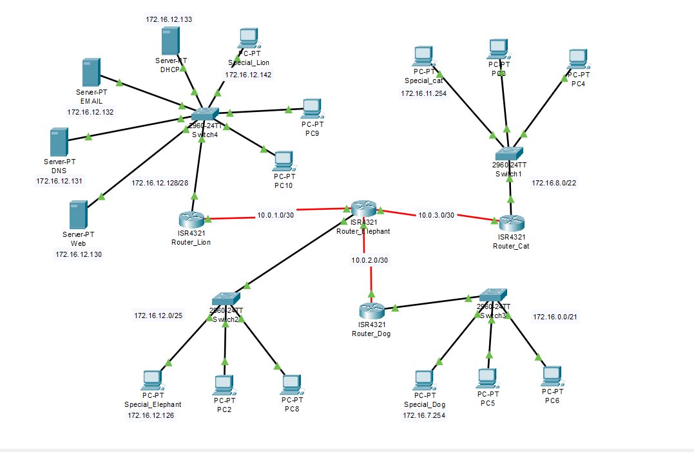
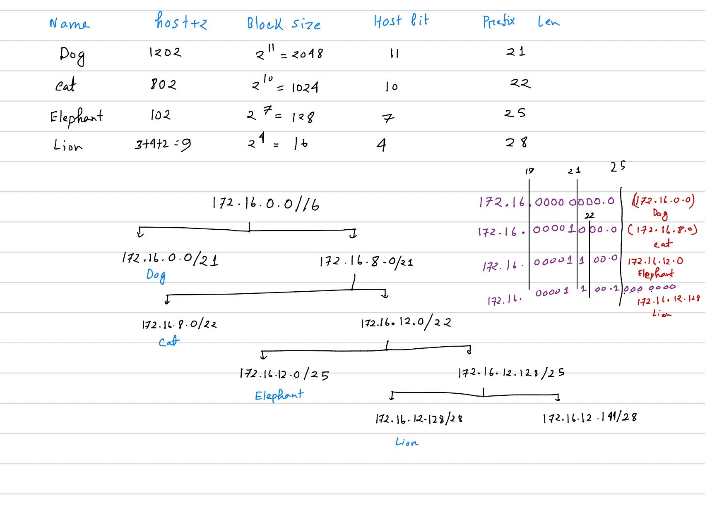

# Animal Kingdom Tribal Network — Cisco Packet Tracer Project

A simulated enterprise network built in Cisco Packet Tracer, modeled as four "tribes" (Dog, Cat, Elephant, Lion) connected through a central hub router. The project covers VLSM subnetting, inter-router routing (RIPv2), DHCP relay, and core network services (Web, DNS, Email, DHCP) hosted centrally.

## Table of Contents

- [Overview](#overview)
- [Repository Contents](#repository-contents)
- [Network Topology](#network-topology)
- [Design Assumptions](#design-assumptions)
- [VLSM Subnetting](#vlsm-subnetting)
- [VLSM Tree](#vlsm-tree)
- [IP Addressing](#ip-addressing)
- [WAN Links](#inter-router-wan-link-table)
- [Network Services](#network-services)
- [Getting Started](#getting-started)
- [Team / Work Distribution](#team--work-distribution)

## Overview

The **Elephant** router acts as the central hub, connecting to three tribes — **Lion**, **Dog**, and **Cat** — over simulated WAN (Serial DCE) links. The **Lion** tribe is the capital and hosts all critical servers (Web, DNS, Email, DHCP). Since the DHCP server sits in the Lion tribe, the Dog, Cat, and Elephant routers are configured as DHCP relay agents (`ip helper-address`) so their local clients can still obtain addresses. Routing between all four routers is handled with **RIPv2**.

## Repository Contents

| File | Description |
| --- | --- |
| `Animal_kingdom.pkt` | Final Cisco Packet Tracer network file |
| `Animal_kingdom_small_update.pkt` | Minor-update / working version of the Packet Tracer file |
| `Report.docx` | Full project report — assumptions, IP tables, DHCP/Web/DNS/Email config, router commands |
| `Labeled_Topology_Diagram.docx` | Labeled network topology diagram |
| `images/topology.png` | Exported topology diagram |
| `images/vlsm-tree.png` | Exported VLSM subnetting tree |

## Network Topology



**Hardware & physical connections:**
- Router **Elephant** is the central hub with multiple Serial ports, connecting to Lion, Dog, and Cat.
- All router-to-router links use **Serial DCE cables**, simulating long-distance WAN connections even though the tribes are logically close.
- All local (PC-to-Switch) connections use standard **Ethernet straight-through** cables.

## Design Assumptions

**IP Addressing Rules**
- **VLSM efficiency:** subnets are sized to each tribe's needs — Dog `/21`, Cat `/22`, Elephant `/25`, Lion `/28` — to minimize address waste while allowing future growth.
- **Link conservation:** every WAN link between routers uses a `/30` prefix (2 usable addresses), so no IPs are wasted on router-to-router links.
- **The Chief Rule:** Tribal Chiefs (special computers) and servers use **static IPs** for consistent addressing in logs/administration; regular members use **dynamic (DHCP)** IPs.

**Routing & Traffic Flow**
- **RIPv2** was chosen as the routing protocol — simple and reliable for a small, 4-router network, and it supports VLSM.
- **No redundancy:** a single active path connects each tribe; no backup routers or links are simulated.

**Network Services**
- **Centralized management:** the Lion tribe hosts all critical servers (Web, DNS, Email, DHCP). If the link to Lion goes down, the other tribes lose these services.
- **DHCP relay:** since the DHCP server lives in the Lion tribe, the Dog, Cat, and Elephant routers act as relay agents via `ip helper-address` on their gateway interfaces.
- **Identity:** all users share the single domain `animals.com` for email and web services.

## VLSM Subnetting

| Tribe | Hosts Needed | Hosts + 2 | Block Size | Host Bits | Network (CIDR) |
| --- | --- | --- | --- | --- | --- |
| Dog | 1200 | 1202 | 2^11 = 2048 | 11 | /21 |
| Cat | 800 | 802 | 2^10 = 1024 | 10 | /22 |
| Elephant | 100 | 102 | 2^7 = 128 | 7 | /25 |
| Lion | 7 | 9 | 2^4 = 16 | 4 | /28 |

## VLSM Tree



## IP Addressing

### IP Address Table

| Tribe | Hosts | Network Address | Subnet Mask | Usable Range | Default Gateway | Server |
| --- | --- | --- | --- | --- | --- | --- |
| Dog | 1200 | 172.16.0.0 | 255.255.248.0 | 172.16.0.2 – 172.16.7.253 | 172.16.0.1 | DNS – 172.16.12.131 |
| Cat | 800 | 172.16.8.0 | 255.255.252.0 | 172.16.8.2 – 172.16.11.253 | 172.16.8.1 | WEB – 172.16.12.130 |
| Elephant | 100 | 172.16.12.0 | 255.255.255.128 | 172.16.12.2 – 172.16.12.125 | 172.16.12.1 | Email – 172.16.12.132 |
| Lion | 7 | 172.16.12.128 | 255.255.255.240 | 172.16.12.130 – 172.16.12.142 | 172.16.12.129 | DHCP – 172.16.12.133 |

### Server IP Address Table

| Server | Static IP | Subnet Mask | Default Gateway |
| --- | --- | --- | --- |
| Web Server | 172.16.12.130 | 255.255.255.240 | 172.16.12.129 |
| DNS Server | 172.16.12.131 | 255.255.255.240 | 172.16.12.129 |
| Email Server | 172.16.12.132 | 255.255.255.240 | 172.16.12.129 |
| DHCP Server | 172.16.12.133 | 255.255.255.240 | 172.16.12.129 |

### Special Computer (Tribal Chief) IP Addresses

| Tribe | Static IP | Subnet Mask | Default Gateway |
| --- | --- | --- | --- |
| Dog | 172.16.7.254 | 255.255.248.0 | 172.16.0.1 |
| Cat | 172.16.11.254 | 255.255.252.0 | 172.16.8.1 |
| Elephant | 172.16.12.126 | 255.255.255.128 | 172.16.12.1 |
| Lion | 172.16.12.142 | 255.255.255.240 | 172.16.12.129 |

## Inter-Router (WAN) Link Table

| Segment | Network Address | Mask | Router 1 IP | Router 2 IP |
| --- | --- | --- | --- | --- |
| Lion–Elephant | 10.0.1.0 | 255.255.255.252 | 10.0.1.1 (Lion) | 10.0.1.2 (Elephant) |
| Elephant–Dog | 10.0.2.0 | 255.255.255.252 | 10.0.2.1 (Elephant) | 10.0.2.2 (Dog) |
| Elephant–Cat | 10.0.3.0 | 255.255.255.252 | 10.0.3.1 (Elephant) | 10.0.3.2 (Cat) |

## Network Services

### DHCP Server Pools

**Dog Pool**
- Default Gateway: `172.16.0.1`
- DNS Server: `172.16.12.131`
- Start IP: `172.16.0.2`
- Subnet Mask: `255.255.248.0`
- Max Users: 1200

**Cat Pool**
- Default Gateway: `172.16.8.1`
- DNS Server: `172.16.12.131`
- Start IP: `172.16.8.2`
- Subnet Mask: `255.255.252.0`

**Elephant Pool**
- Default Gateway: `172.16.12.1`
- DNS Server: `172.16.12.131`
- Start IP: `172.16.12.2`
- Subnet Mask: `255.255.255.128`

### Web Server
- IP Address: `172.16.12.130` (Static)
- Hosted page: `index.html`

```html
<html>
<center><font size='+2' color='blue'>Welcome to the Animal Kingdom! </font></center>
</html>
```

### DNS Server
- Domain Name: `www.animals.com`
- Record Type: A
- Address: `172.16.12.130`

### Email Server
- Domain Name: `animals.com`
- User Accounts:

| Username | Password |
| --- | --- |
| lionking | 1234 |
| dogchief | 1234 |
| elephantchief | 1234 |
| catchief | 1234 |

## Getting Started

1. Install [Cisco Packet Tracer](https://www.netacad.com/courses/packet-tracer) (free with a Cisco Networking Academy account).
2. Clone this repository:
   ```bash
   git clone <repo-url>
   ```
3. Open `Animal_kingdom.pkt` in Packet Tracer to explore the full simulation, or `Animal_kingdom_small_update_.pkt` for the latest working revision.
4. Refer to `Report.docx` for full router configuration commands and design rationale.
